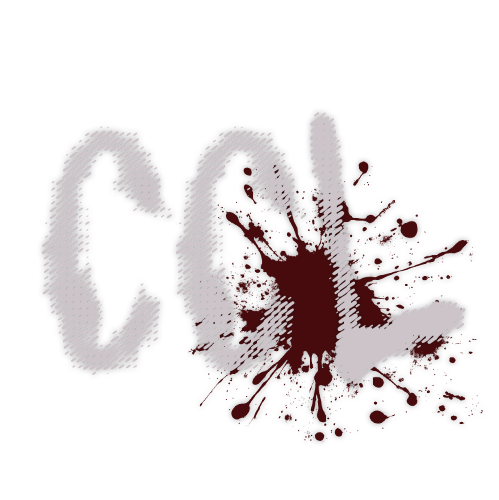

---
hide:
  - navigation
  - toc
  - footer
---

#

<figure markdown="span">
    { width="384" }
</figure>

    The official servers are dead. We brought them back.

    Checking server...

- :material-earth: **Join the Server**

    ---

    Set your DNS to `46.62.159.148` and you're in. Two minutes, done.

    ---

    [:octicons-arrow-right-24: Setup Guide](guides/joining/getting-started.md)

- :material-server: **Host Your Own**

    ---

    One binary, one command. Run a private camp for you and your friends.

    ---

    [:octicons-arrow-right-24: Hosting Guide](guides/hosting/getting-started.md)

- :simple-discord: **Join the Community**

    ---

    Matchmaking, stats, bug reports, trophy boosting. All on Discord.

    ---

    [:octicons-arrow-right-24: About the community](guides/community/about.md)

